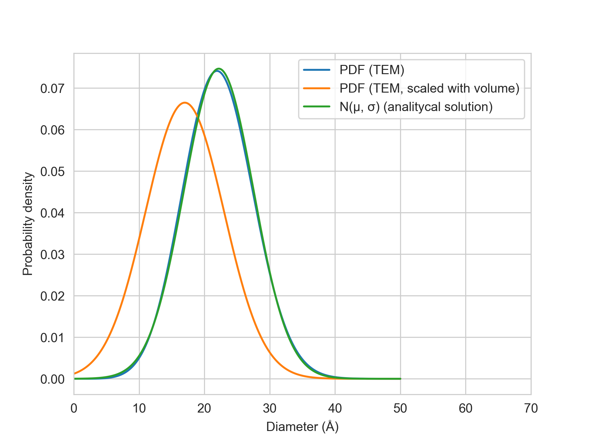

---
marp:true
theme: default
paginate: true
footer: "Conversion of PDF from particle average to atom average"
marp: true
---

# Conversion of PDF from particle average to atom average
Aug 28, 2023

---
# Conversion of PDF from particle average to atom average

- Particle size distribution (PDF) measured by TEM is usually a particle average PDF.

- In XAS, The average spectrum is and atom average of all the sites.

- Therefore, the particle size obtained from TEM and particle size obtained from XAS will be different. (*Annu. Rev. Anal. Chem.* **2011**. *4*, 23–39)

- Here, we will discuss how to convert the particle average PDF to atom average PDF.

---
# Assumptions

- The particle is spherical.
$$ V(r) = \frac{4}{3}\pi r^3 $$
$$ V(D) = \frac{1}{6}\pi D^3 $$

- The particle size distribution is normal distribution.
$$ f(D) = \frac{1}{\sqrt{2\pi}\sigma} \exp\left(-\frac{(D-\mu)^2}{2\sigma^2}\right) $$

---
# Conversion

When $g(D)$ is the probability density function of particle size distribution scaled by $V(D)$, the conversion of $f(D)$ to $g(D)$ is given by
$$g(D) = \frac{V(D)f(D)}{\int_{-\infty}^{\infty} V(D)f(D) dD}$$

The expectation and variance of $g(D)$ are given by

$$ \mu = \int_{-\infty}^{\infty} D g(D) dD $$
$$ \sigma^2 =\int_{-\infty}^{\infty} (D-\mu)^2 g(D) dD $$
$$= \int_{-\infty}^{\infty} D^2 g(D) dD - \mu^2 $$


---

# Calculation of normalization factor

The integrals were performed using Wolfram Mathematica 12.3.1. The results are given below.
$$\int_{-\infty}^{\infty} V(D)f(D) dD = \frac{1}{\sqrt{2\pi}\sigma} \int_{-\infty}^{\infty} \frac{1}{6}\pi D^3 \exp\left(-\frac{(D-\mu)^2}{2\sigma^2}\right) dD$$

$$=\frac{\pi}{6}\mu(\mu^2+3\sigma^2)$$

Mathematica ouput:


---

# g(D)

$$g(D)  = \frac{x^3}{\mu(\mu^2+3\sigma^2)\sqrt{2\pi}\sigma} \exp\left(-\frac{(D-\mu)^2}{2\sigma^2}\right)$$

---
# Calculation of expectation

$$ \mu = \int_{-\infty}^{\infty} D g(D) dD $$
$$ = \frac{\mu^4 + 6\mu^2\sigma^2 + 3\sigma^4}{\mu(\mu^2+3\sigma^2)} $$

Mathematica output:


---
# Calculation of variance

$$ \sigma^2 =\int_{-\infty}^{\infty} D^2 g(D) dD - \mu^2 $$
$$ = \frac{\mu^4 + 10 \mu^2 \sigma^2 +  15 \sigma^4}{\mu^2 + 3\sigma^2} - \mu^2 $$

Mathematica output:


---

# Mock example

$\mu = 17 Å$, $\sigma = 6 Å$




---
# Conclusion

- The conversion of particle average PDF to atom average PDF obtained by 2 assumptions. 
    - The particle is spherical.
    - The particle size distribution is normal distribution.

- The converted $\mu$ and $\sigma$ are given by
$$ \mu = \frac{\mu^4 + 6\mu^2\sigma^2 + 3\sigma^4}{\mu(\mu^2+3\sigma^2)} $$
$$ \sigma^2 = \frac{\mu^4 + 10 \mu^2 \sigma^2 +  15 \sigma^4}{\mu^2 + 3\sigma^2} - \mu^2 $$

---

# Python code

```python
def mu_vol(mu, sigma):
    return (mu**4 + 6*mu**2*sigma**2 + 3*sigma**4)/(mu*(mu**2 + 3*sigma**2))

def sigma_vol(mu, sigma):
    return np.sqrt((mu**4 + 10 * mu**2 * sigma**2 +  15 * sigma**4)/(mu**2 + 3*sigma**2) - mu_vol(mu, sigma)**2)
```
